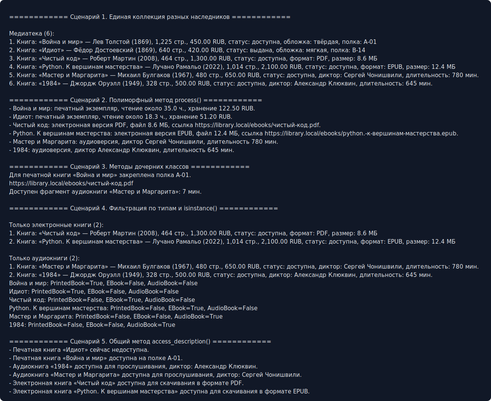

# ЛР-3 — Наследование и иерархия классов

## 1. Цель работы

Цель работы — освоить наследование, построение иерархии классов, переиспользование кода базового класса, переопределение методов и полиморфизм.

## 2. Описание реализованной иерархии классов

Работа сделана поверх существующих ЛР-1/ЛР-2. Старые файлы не изменялись: в ЛР-3 создано расширение базового класса `Book`, которое наследует исходный `Book` из ЛР-2.

Иерархия:

```text
src.lab02.model.Book
└─ src.lab03.base.Book
   ├─ PrintedBook
   ├─ EBook
   └─ AudioBook
```

Дочерние классы:

* `PrintedBook` — печатная книга. Новые атрибуты: `cover_type`, `shelf_code`. Новый метод: `reserve_shelf_place()`.
* `EBook` — электронная книга. Новые атрибуты: `file_format`, `file_size_mb`. Новый метод: `generate_download_link()`.
* `AudioBook` — аудиокнига. Новые атрибуты: `narrator`, `duration_minutes`. Новый метод: `listen_preview()`.

Во всех дочерних классах используется `super()` для вызова конструктора базового класса. Общие данные книги не дублируются.

## 3. Полиморфизм и коллекция

Переопределены методы:

* `__str__()`;
* `calculate_reading_time()`;
* `access_description()`;
* `process()`.

Коллекция `MediaLibrary` наследует поведение `Library` из ЛР-2 и умеет хранить разные типы наследников `Book`, фильтровать их по типу и вызывать общий метод `process()` без условий.

## 4. Демонстрация работы

В `demo.py` показаны сценарии:

* единая коллекция из печатных, электронных и аудиокниг;
* вызов одного метода `process()` с разным поведением;
* использование методов дочерних классов;
* фильтрация по типам;
* проверка через `isinstance()`;
* сортировка и общий метод доступа.

Скриншот вывода:



## 5. Вывод

В работе базовый класс `Book` был расширен через наследование. Получилась иерархия книг, где общая логика хранится в базовом классе, а особенности форматов реализованы в дочерних классах.

