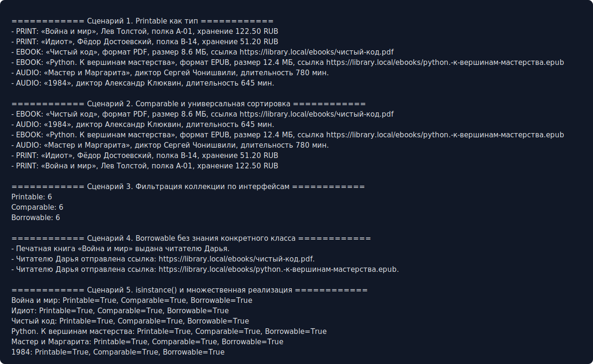

# ЛР-4 — Интерфейсы и абстрактные классы

## 1. Цель работы

Цель работы — познакомиться с абстрактными базовыми классами, создать интерфейсы поведения и закрепить полиморфизм через единый контракт.

## 2. Описание интерфейсов

Созданы интерфейсы через `ABC`:

* `Printable` — требует метод `to_string()`;
* `Comparable` — требует метод `compare_to(other)`;
* `Borrowable` — требует метод `borrow(reader_name)`.

Универсальные функции:

* `print_all(items)` работает с любыми объектами `Printable`;
* `sort_comparable(items)` сортирует объекты через `Comparable`;
* `borrow_all(items, reader_name)` выдаёт объекты через `Borrowable`.

## 3. Реализация в классах

Интерфейсы реализуют:

* `InterfacePrintedBook`;
* `InterfaceEBook`;
* `InterfaceAudioBook`.

Каждый класс реализует методы по-разному:

* печатная книга выдаётся физически и учитывает полку;
* электронная книга отправляет ссылку на файл;
* аудиокнига открывает доступ к прослушиванию.

Один объект реализует несколько интерфейсов одновременно: `Printable`, `Comparable` и `Borrowable`.

## 4. Демонстрация

В `demo.py` показаны сценарии:

* вывод разных книг через интерфейс `Printable`;
* сортировка через `Comparable`;
* фильтрация коллекции по интерфейсам;
* выдача книг через `Borrowable`;
* проверка типов через `isinstance()`.

Скриншот вывода:

## 5. Вывод

Интерфейсы позволяют писать универсальные функции, которым не важно, с каким конкретным типом книги они работают. Главное, чтобы объект выполнял нужный контракт поведения.

