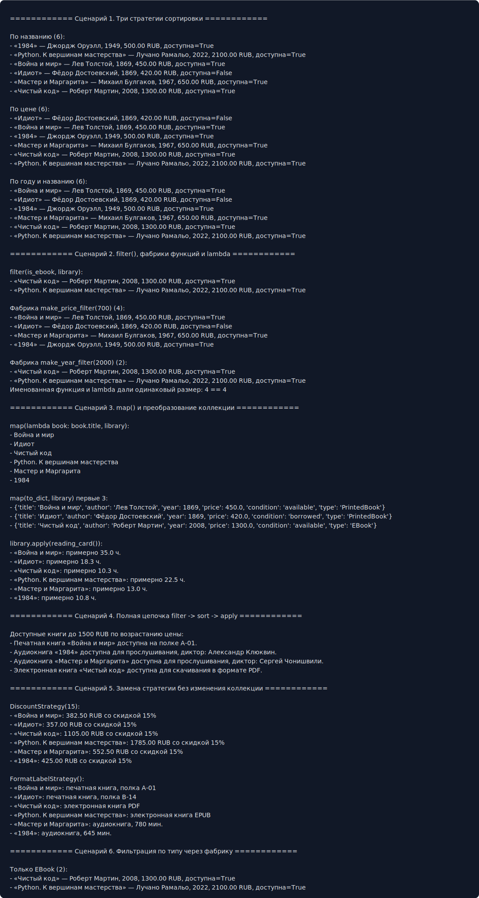

# ЛР-5 — Функции как аргументы. Стратегии и делегаты

## 1. Цель работы

Цель работы — освоить передачу функций как аргументов, функции высшего порядка, `lambda`, `map`, `filter`, `sorted`, фабрики функций и паттерн «Стратегия».

## 2. Реализованные функции и стратегии

Функции сортировки:

* `by_title(book)` — по названию и автору;
* `by_price(book)` — по цене;
* `by_year_then_title(book)` — по году и названию.

Функции-фильтры:

* `is_available(book)` — доступные книги;
* `is_ebook(book)` — электронные книги через `isinstance`;
* `is_long_reading(book)` — книги с чтением больше 12 часов.

Фабрики функций:

* `make_price_filter(max_price)`;
* `make_year_filter(min_year)`;
* `make_type_filter(book_type)`;
* `reading_card(hours_label)`.

Преобразования:

* `to_summary(book)`;
* `to_dict(book)`.

Callable-стратегии:

* `DiscountStrategy(percent)` — считает цену со скидкой;
* `AccessStrategy()` — возвращает способ доступа;
* `FormatLabelStrategy()` — определяет формат книги.

Коллекция `StrategyLibrary` поддерживает:

* `sort_by(key_func)`;
* `filter_by(predicate)`;
* `apply(func)`;
* цепочки операций `filter_by(...).sort_by(...).apply(...)`.

## 3. Демонстрация работы

В `demo.py` показаны сценарии:

* сортировка одной коллекции тремя стратегиями;
* фильтрация через `filter()`;
* фабрики функций;
* сравнение `lambda` и именованной функции;
* преобразования через `map()`;
* полная цепочка `filter -> sort -> apply`;
* замена стратегии без изменения коллекции;
* callable-объект как стратегия.

Скриншот вывода:

## 4. Вывод

В работе функции используются как полноценные объекты: передаются в методы коллекции, создаются фабриками и заменяются без изменения кода библиотеки. Паттерн «Стратегия» реализован через callable-классы.

