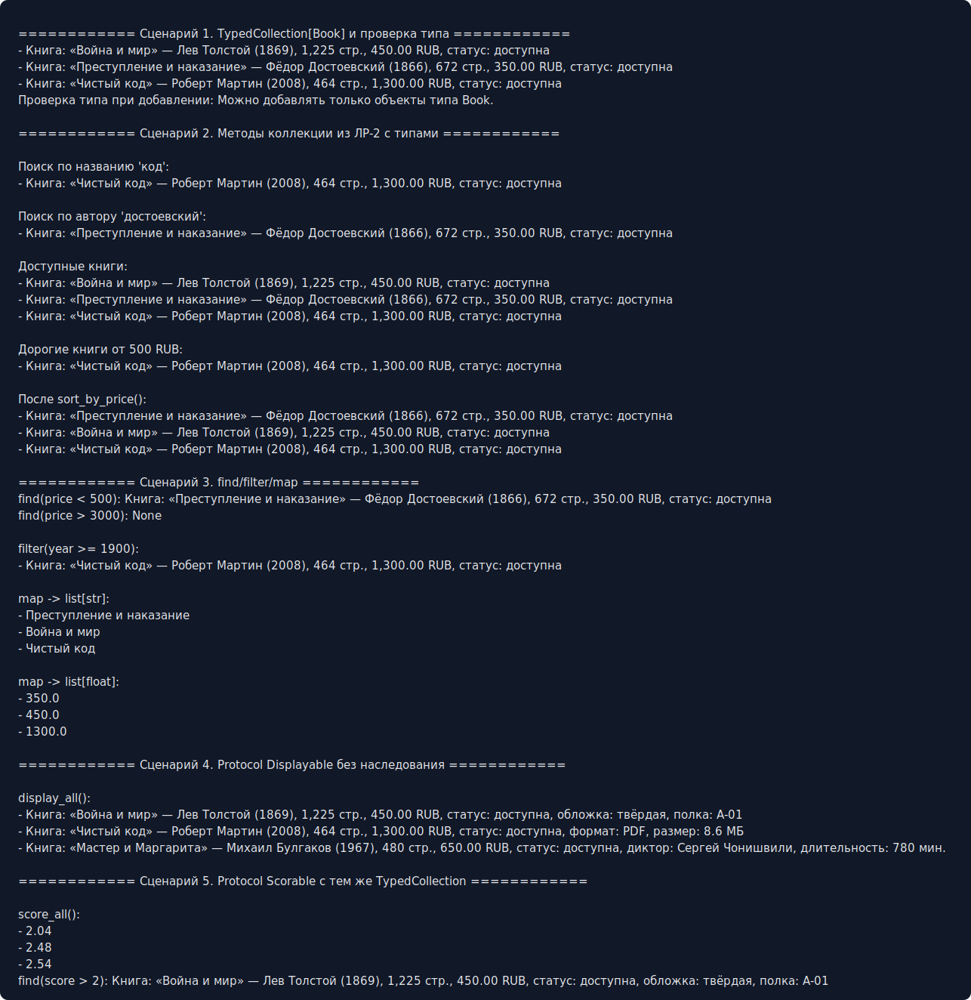

# ЛР-6 — Generics и typing

## 1. Цель работы

Цель работы — освоить аннотации типов, generic-классы, `TypeVar`, `Generic` и структурную типизацию через `Protocol`.

## 2. Описание реализованных типов и контейнеров

В ЛР-1 у класса `Book` добавлены аннотации атрибутов в конструкторе и методы:

* `display() -> str`;
* `score() -> float`.

В ЛР-3 расширенный базовый класс `Book` также получил метод `score()`, поэтому все дочерние классы `PrintedBook`, `EBook`, `AudioBook` подходят под протоколы без явного наследования.

В `container.py` реализованы:

* `T = TypeVar("T")` — тип элемента коллекции;
* `R = TypeVar("R")` — тип результата для метода `map()`;
* `TypedCollection(Generic[T])` — generic-версия коллекции `Library` из ЛР-2;
* `Displayable(Protocol)` — требует метод `display() -> str`;
* `Scorable(Protocol)` — требует метод `score() -> float`;
* `D = TypeVar("D", bound=Displayable)`;
* `S = TypeVar("S", bound=Scorable)`.

`TypedCollection` повторяет интерфейс коллекции из ЛР-2:

* `add()`;
* `remove()`;
* `remove_at()`;
* `get_all()`;
* `find_by_title()`;
* `find_by_author()`;
* `sort_by_price()`;
* `sort_by_year()`;
* `get_available()`;
* `get_expensive()`;
* `__len__()`;
* `__iter__()`;
* `__getitem__()`.

Дополнительно реализованы методы:

* `find(predicate) -> Optional[T]`;
* `filter(predicate) -> list[T]`;
* `map(transform) -> list[R]`;
* `display_all()` для `TypedCollection[D]`;
* `score_all()` для `TypedCollection[S]`.

## 3. Демонстрация работы

В `demo.py` показаны сценарии:

* создание `TypedCollection[Book]`;
* проверка типа при добавлении неправильного объекта;
* работа методов коллекции из ЛР-2;
* `find()` с найденным элементом и результатом `None`;
* `filter()` для выборки книг;
* `map()` с результатами разных типов: `list[str]` и `list[float]`;
* `TypedCollection[Displayable]` с разными объектами из иерархии ЛР-3;
* `TypedCollection[Scorable]` с теми же объектами, но через другой Protocol.

Скриншот вывода:

## 4. Вывод

В работе были изучены аннотации типов, `Generic`, `TypeVar`, ограниченные `TypeVar` и `Protocol`. Типизация помогает явно показать, какие объекты хранит коллекция, какие функции можно передавать в методы и какие возможности ожидаются от объектов без жёсткого наследования.

