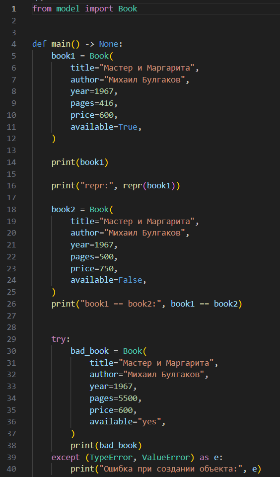
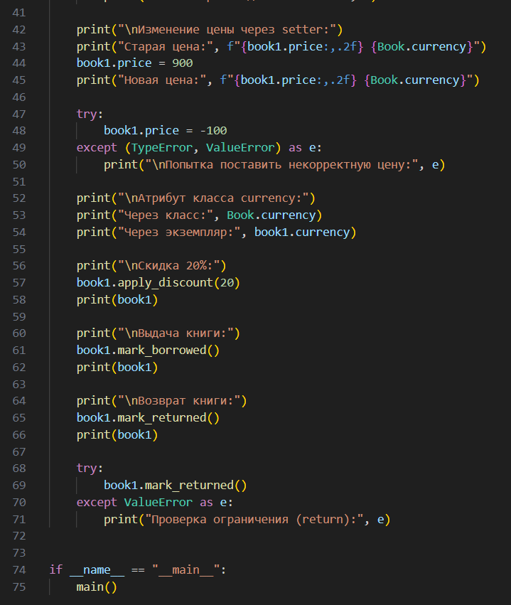

# Лабораторная работа №1

Перед тем как начать писать класс, я сначала подумала, что именно нужно хранить о книге: название, автора, год издания, количество страниц, цену и статус: книга в наличии или выдана кому-то. 

Валюта у нас одна для всех, поэтому я решила сделать её атрибутом класса, чтобы не повторяться в каждом экземпляре. Дальше я подумала, что нельзя же разрешить менять всё подряд, а то можно случайно сделать название числом или цену отрицательной. Поэтому я решила сделать поля закрытыми, добавив к ним подчёркивание, а в конструкторе прописать проверки.

Для названия и автора я проверяю, чтобы это были непустые строки, и сразу убираю лишние пробелы по краям. Год я ограничила от 1450, когда книгопечатание появилось, до 2026, чтобы учесть и современную литературу. Страницы от 10 до 5000, потому что слишком маленькие или огромные числа не могут быть количеством страниц. Цена должна быть неотрицательной и не слишком большой. Доступность - true или false, потому что книга либо доступна либо нет. Чтобы можно было читать все эти данные, я использовала property-это позволяет обращаться к ним как к обычным атрибутам, но при этом они остаются защищёнными. 

Менять я разрешила только цену, потому что бывают скидки. Для этого я сделала setter, который тоже проверяет новое значение. Из бизнес-методов мне понадобились скидка, выдача книги и возврат. Для скидки я проверяю, что процент - это число от 0 до 100, а потом пересчитываю цену. Для выдачи проверяю, что книга доступна, потому что нельзя же выдать то, чего нет. Для возврата наоборот, что книга выдана. 

Ещё я добавила метод str для красивого вывода, repr для отладки, чтобы видеть, как создавался объект, и eq для сравнения книг. Я решила, что две книги одинаковые, если у них совпадают название, автор и год, регистр не важен. А проверки я вынесла в отдельные методы, потому что они не привязаны к конкретному экземпляру и только проверяют данные.

### Проверка

На скриншоте видно, как я создаю две книги с одинаковыми названием, автором и годом, но разными страницами и ценой. Сравнение показало true, значит, логика eq работает правильно. Str вывел красивую строчку, а repr — техническую. Дальше я специально попробовала создать книгу с неправильными данными: страниц 5500, а доступность передала строкой "yes". При создании вылетела ошибка, и программа написала, что страницы должны быть от 10 до 5000. Значит, валидация сработала и плохой объект не создался. Потом я меняю цену через сеттер с 600 на 900, и всё проходит. Потом я попробовала поставить цену -100, и программа выдала ошибку, что цена должна быть больше или равна нулю. Ещё я проверила атрибут класса currency и он одинаково доступен и через класс, и через экземпляр. И я применила скидку 20%, цена уменьшилась с 900 до 720. Потом выдала книгу, статус стал "выдана". Вернула и снова "доступна". А когда попробовала вернуть второй раз, программа не дала и написала, что нельзя вернуть книгу, которая уже доступна. Всё работает как надо.

